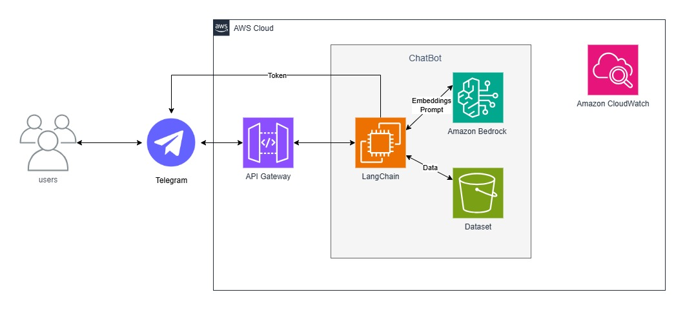

# Themis - Assistente Jurídica Virtual

**Chatbot RAG para Consulta de Documentos Jurídicos**

Projeto desenvolvido como avaliação das Sprints 7 e 8 do Programa de Bolsas Compass UOL / AWS - turma março/2025.

***

## 👥 Equipe de Desenvolvimento

- **Jefferson Silva Caires**
- **Gabriel dos Santos Xavier** 
- **Gilberto de Paiva Melo**
- **Douglas Vieira Damascena dos Santos**

***

## 🎯 Sobre o Projeto

**Themis** é uma assistente jurídica virtual inteligente que utiliza tecnologia RAG (Retrieval Augmented Generation) para analisar documentos jurídicos e responder consultas específicas. O sistema combina AWS Bedrock, LangChain e ChromaDB para fornecer respostas precisas baseadas exclusivamente no contexto dos documentos carregados.

### Principais Funcionalidades:
- 🤖 **Interface via Telegram** - Interação natural através de mensagens de texto e áudio
- 📄 **Processamento de PDFs Jurídicos** - Análise automática de documentos legais
- 🧠 **RAG com AWS Bedrock** - Respostas contextualizadas usando modelos Amazon Nova Pro
- 💾 **Histórico Persistente** - Manutenção do contexto conversacional entre sessões
- 🎤 **Suporte a Áudio** - Transcrição automática via AWS Transcribe
- ☁️ **Infraestrutura AWS** - Hospedado em EC2 t3.small com armazenamento S3

***

## 🏗️ Arquitetura do Sistema



### Componentes AWS Utilizados:
- **EC2 (t3.small)** - Hospedagem da aplicação
- **S3** - Armazenamento dos documentos PDF
- **Bedrock** - Modelos de IA (Amazon Nova Pro + Titan Embeddings)
- **Transcribe** - Conversão de áudio para texto
- **CloudWatch** - Monitoramento e logs

### Stack Tecnológica:
- **Python 3.12** - Linguagem principal
- **LangChain** - Framework para aplicações LLM
- **ChromaDB** - Banco de dados vetorial
- **pyTelegramBotAPI** - Interface do bot
- **Boto3** - SDK AWS para Python

***

## 📁 Estrutura do Projeto

```
sprints-7-8-pb-aws-marco/
├── README.md
├── requirements.txt
├── assets/
│   └── sprints_7-8.jpg
├── dataset/
│   └── juridicos.zip
└── langchain/
    ├── main.py                 # Aplicação principal
    ├── dataset/               # PDFs jurídicos locais
    ├── historicos/           # Dados de conversação
    ├── utils/               # Módulos utilitários
    │   ├── bedrockUtils.py  # Integração com Bedrock
    │   ├── s3Utils.py       # Operações S3
    │   ├── dataUtils.py     # Gerenciamento de dados
    │   └── transcribeUtils.py # Transcrição de áudio
    └── vector_store/        # Base de conhecimento ChromaDB
        └── chroma/
```

***

## 🚀 Como Utilizar o Sistema

### Acesso ao Bot Telegram:
**URL do Bot:** [`@ThemisJuridicaBot`](https://t.me/DocsJuridicos_grupo_2_bot) (no Telegram)

### Tipos de Interação:

1. **Mensagens de Texto:**
   - Envie sua dúvida jurídica diretamente
   - A Themis responderá baseada nos documentos carregados
   - Histórico de conversação é mantido automaticamente

2. **Mensagens de Áudio:**
   - Grave sua pergunta em áudio
   - O sistema transcreve automaticamente
   - Resposta é fornecida em texto

### Exemplos de Consultas:
- "O que dizem os acórdãos sobre recursos extraordinários?"
- "Quais são os critérios para admissibilidade de agravos?"
- "Explique as decisões sobre embargos declaratórios"

***

## ⚙️ Configuração e Implantação

### Pré-requisitos:
- Conta AWS com acesso ao Bedrock
- Bot Telegram criado via BotFather
- Instância EC2 t3.small configurada

### Variáveis de Ambiente:
```bash
BOT_API_TOKEN=seu_token_telegram
BUCKET_NAME=nome_do_bucket_s3
EMBEDDING_MODEL=modelo_de_embad
MODEL_ID=modelo_llm_para_respostas
```

### Instalação:
```bash
# Clonar o repositório
git clone <repositorio>

# Instalar dependências
pip install -r requirements.txt

# Executar a aplicação
cd langchain
python main.py
```

***

## 🔧 Detalhes Técnicos

### Modelos AWS Bedrock:
- **Embeddings:** `amazon.titan-embed-text-v2:0`
- **LLM:** `amazon.nova-pro-v1:0`

### Configuração RAG:
- **Chunk Size:** 1000 caracteres
- **Overlap:** 180 caracteres
- **Retrieval:** MMR (Maximal Marginal Relevance)
- **K Documents:** 4 documentos recuperados

### Persistência:
- **Vector Store:** ChromaDB local
- **Histórico:** JSON files por usuário
- **Documentos:** S3 bucket com download automático

***

## 🎯 Funcionalidades Implementadas

### ✅ Requisitos Atendidos:
- [x] Chatbot LangChain em EC2
- [x] Documentos no S3 
- [x] Embeddings com Bedrock
- [x] Indexação com Chroma
- [x] Interface Telegram
- [x] Retrieval com Bedrock
- [x] Logs CloudWatch
- [x] Estrutura modular
- [x] Suporte a áudio (extra)
- [x] Histórico persistente (extra)

### 🔄 Fluxo de Funcionamento:
1. Usuário envia mensagem no Telegram
2. Sistema carrega/verifica vector store
3. Recupera documentos relevantes via RAG
4. Gera resposta contextualizada com Bedrock
5. Armazena histórico da conversa
6. Retorna resposta ao usuário

***

## 🛠️ Dificuldades Conhecidas e Soluções

### Desafios Encontrados:

1. **Gerenciamento de Estado:**
   - **Problema:** Manter contexto entre reinicializações
   - **Solução:** Sistema de cache em memória + persistência em disco

2. **Performance em t3.small:**
   - **Problema:** Limitações de recursos para embeddings
   - **Solução:** Verificação de vector store existente antes de recriar

3. **Handling de Áudio:**
   - **Problema:** Diferentes formatos de áudio do Telegram
   - **Solução:** Conversão automática e upload para S3

4. **Context Window:**
   - **Problema:** Limitação de tokens nos modelos
   - **Solução:** Estratégia MMR para seleção de documentos relevantes

### Otimizações Implementadas:
- Cache inteligente de vector store
- Download assíncrono de PDFs do S3
- Validação prévia de recursos AWS
- Tratamento robusto de exceções

***

## 📊 Logs e Monitoramento

O sistema utiliza CloudWatch para:
- Logs de execução da aplicação
- Métricas de uso do bot
- Monitoramento de erros
- Rastreamento de interações de usuários

Logs são estruturados para facilitar debugging e análise de performance.

## 📝 Conclusão

A **Themis** representa uma solução completa para consulta inteligente de documentos jurídicos, combinando tecnologias modernas de IA com uma interface acessível. O sistema demonstra a eficácia da arquitetura RAG para aplicações especializadas, mantendo alta precisão nas respostas através do contexto restrito aos documentos carregados.

O projeto atende integralmente aos requisitos das sprints, implementando funcionalidades extras que enriquecem a experiência do usuário e demonstram domínio técnico da equipe nas tecnologias AWS e frameworks de IA.
